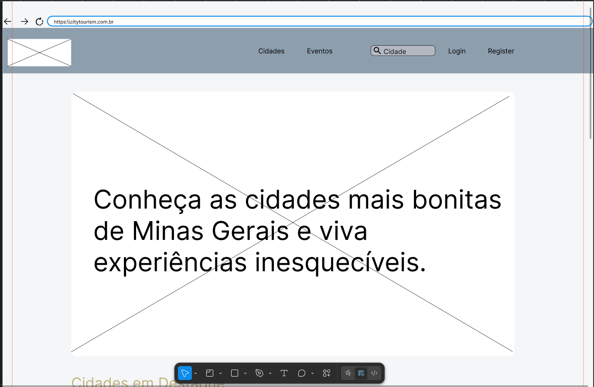
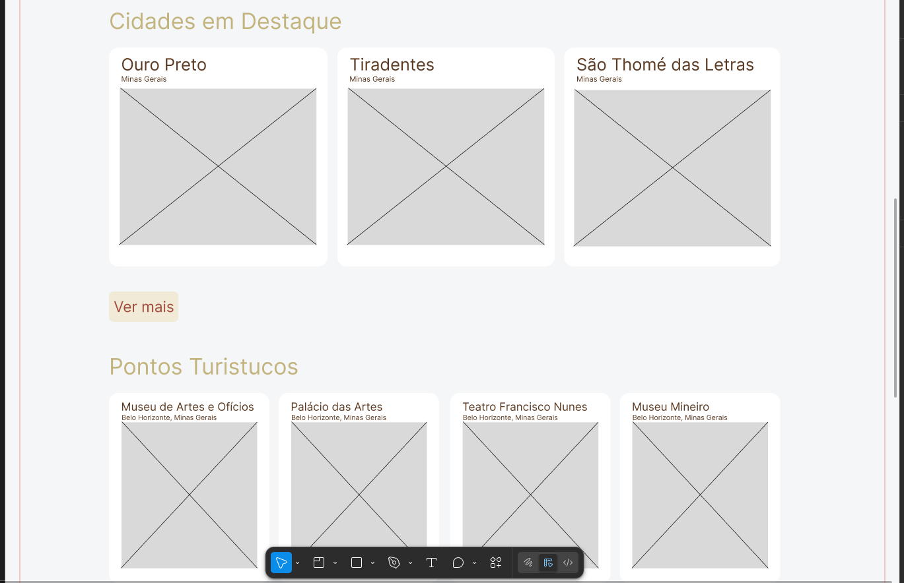
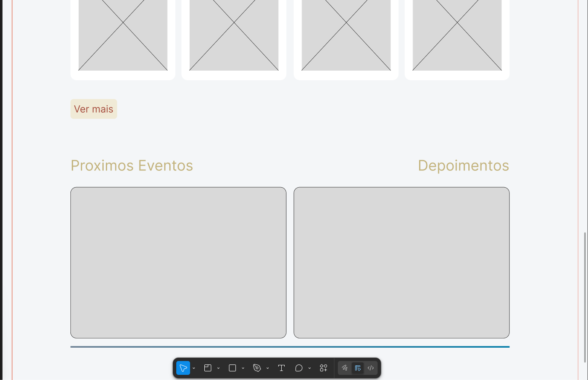
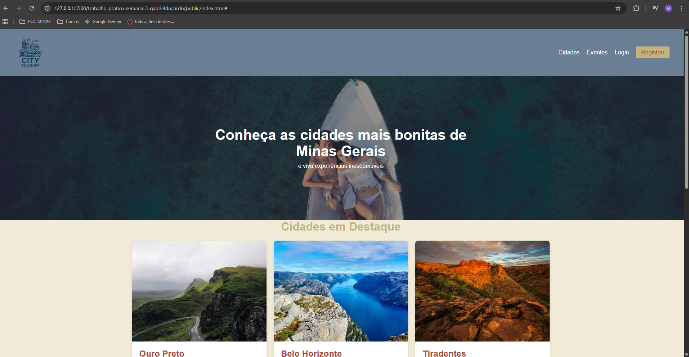
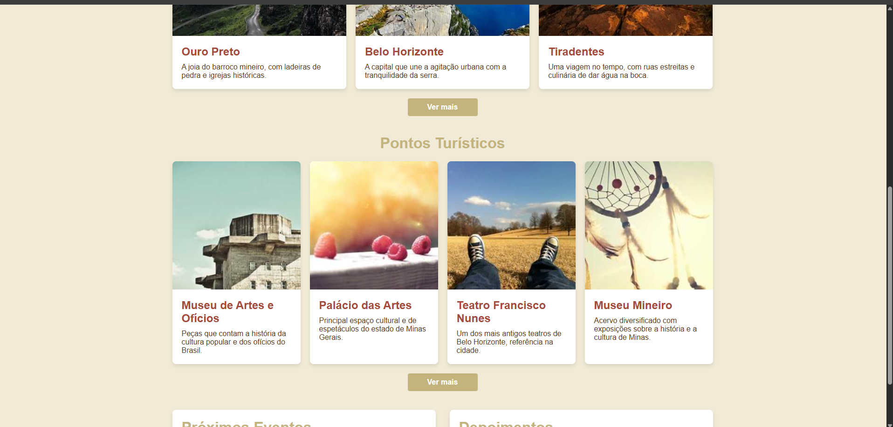
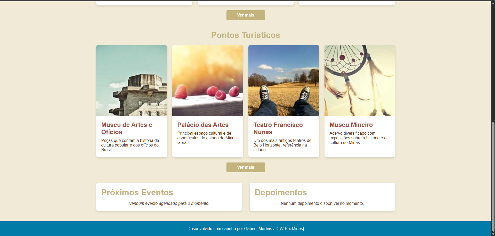

# Trabalho Prático - Semana 03

Dessa vez, vamos escolher uma proposta de projeto para trabalhar.

Nessa atividade, você deverá montar a página inicial do projeto escolhido, a organização do HTML aplicando semântica correta e uso aprimorado do CSS. Leia o enunciado completo no Canvas para mais detalhes.

**IMPORTANTE:** Você deve trabalhar e alterar apenas arquivos dentro da pasta **`public`**. Deixe todos os demais arquivos e pastas desse repositório inalterados. **PRESTE MUITA ATENÇÃO NISSO.**

## Informações Gerais

- Nome: Gabriel Eduardo de Oliveira Martins
- Matricula:
- Proposta de projeto escolhida: A proposta que escolhi é criar um site para mostrar um pouco das cidades mineiras, e sugerir locais como parques, museus e teatros para que a populção possa conhecer.
- Breve descrição sobre seu projeto: A ideia do meu projeto é de criar um site onde a população mineira possa conhecer mais sobre o Estado, conhecer novas cidades, museus, teatros, parques, e possa ser avisada onde vai ver eventos. 

## Print do(s) wireframe(s) criado

  
  
  

## Print da home-page criada

  
  
  
